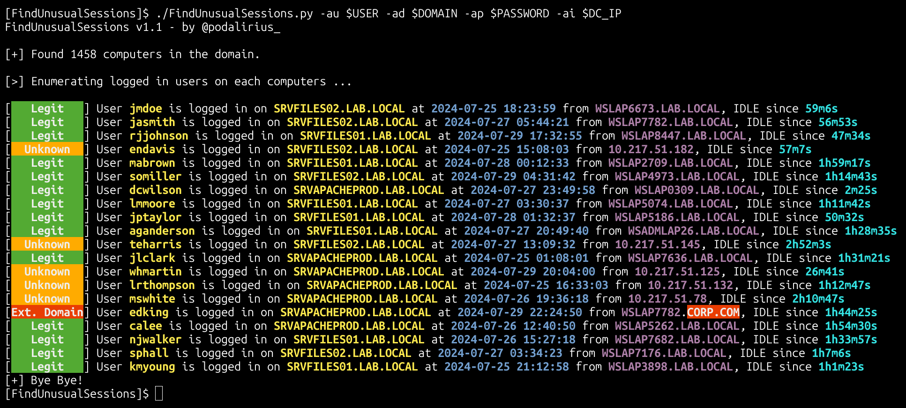

<p align="center">
    Detect Unusual sessions opened on remote machines using RPC!
    <br>
    
    <a href="https://twitter.com/intent/follow?screen_name=podalirius_" title="Follow"></a>
    <a href="https://www.youtube.com/c/Podalirius_?sub_confirmation=1" title="Subscribe"></a>
    <br>
</p>

## Features

- [x] Extracts the list of legitimate domains and trusts registered in the LDAP
- [x] Maps the current sessions open on remote machines through RPC
- [x] Highlight suspicious sessions
- [x] Multithreaded connections to enum remote sessions.
- [ ] Export results in JSON with `--export-json <file.json>`.
- [ ] Export results in XLSX with `--export-xlsx <file.xlsx>`.
- [ ] Export results in SQLITE3 with `--export-sqlite <file.db>`.

## Demonstration

```
./FindUnusualSessions.py -au $USER -ad $DOMAIN -ap $PASSWORD -ai $DC_IP
```



## Usage

```
$ ./FindUnusualSessions.py -h
FindUnusualSessions v1.1 - by Remi GASCOU (Podalirius)

usage: FindUnusualSessions.py [-h] [-v] [--debug] [--no-colors] [-L LOGFILE] [-t THREADS] [-ns NAMESERVER] [-tf TARGETS_FILE] [-tt TARGET] [-ad AUTH_DOMAIN] [-ai AUTH_DC_IP] [-au AUTH_USER] [--ldaps]
                              [--no-ldap] [--subnets] [-tl TARGET_LDAP_QUERY] [--no-pass | -ap AUTH_PASSWORD | -ah AUTH_HASHES | --aes-key hex key] [-k] [--kdcHost AUTH_KDCHOST] [--export-xlsx EXPORT_XLSX]
                              [--export-json EXPORT_JSON] [--export-sqlite EXPORT_SQLITE]

options:
  -h, --help            show this help message and exit
  -v, --verbose         Verbose mode. (default: False).
  --debug               Debug mode. (default: False).
  --no-colors           Disables colored output mode.
  -L LOGFILE, --logfile LOGFILE
                        File to write logs to.
  -t THREADS, --threads THREADS
                        Number of threads (default: 64).
  -ns NAMESERVER, --nameserver NAMESERVER
                        IP of the DNS server to use, instead of the --dc-ip.

Targets:
  -tf TARGETS_FILE, --targets-file TARGETS_FILE
                        Path to file containing a line by line list of targets.
  -tt TARGET, --target TARGET
                        Target IP, FQDN or CIDR.
  -ad AUTH_DOMAIN, --auth-domain AUTH_DOMAIN
                        Windows domain to authenticate to.
  -ai AUTH_DC_IP, --auth-dc-ip AUTH_DC_IP
                        IP of the domain controller.
  -au AUTH_USER, --auth-user AUTH_USER
                        Username of the domain account.
  --ldaps               Use LDAPS (default: False)
  --no-ldap             Do not perform LDAP queries.
  --subnets             Get all subnets from the domain and use them as targets (default: False)
  -tl TARGET_LDAP_QUERY, --target-ldap-query TARGET_LDAP_QUERY
                        LDAP query to use to extract computers from the domain.

Credentials:
  --no-pass             Don't ask for password (useful for -k)
  -ap AUTH_PASSWORD, --auth-password AUTH_PASSWORD
                        Password of the domain account.
  -ah AUTH_HASHES, --auth-hashes AUTH_HASHES
                        LM:NT hashes to pass the hash for this user.
  --aes-key hex key     AES key to use for Kerberos Authentication (128 or 256 bits)
  -k, --kerberos        Use Kerberos authentication. Grabs credentials from .ccache file (KRB5CCNAME) based on target parameters. If valid credentials cannot be found, it will use the ones specified in the
                        command line
  --kdcHost AUTH_KDCHOST
                        IP of the domain controller.

Output files:
  --export-xlsx EXPORT_XLSX
                        Output XLSX file to store the results in.
  --export-json EXPORT_JSON
                        Output JSON file to store the results in.
  --export-sqlite EXPORT_SQLITE
                        Output SQLITE3 file to store the results in.

```

## Contributing

Pull requests are welcome. Feel free to open an issue if you want to add other features.
